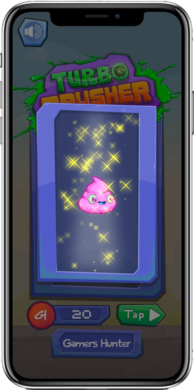
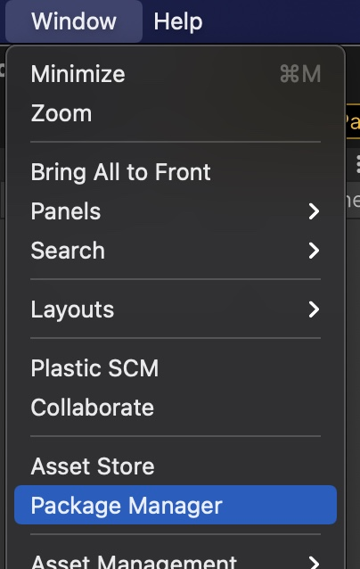
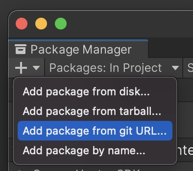

# Unity GamersHunter Marketplace Package
GamersHunter Package V1.0.0 for Unity 

-------
# Overview
GamersHunter Marketplace is a new way to monetize your mobile games and take the user experience to a new level, by rewarding them for doing what they already do, play their favorite game. 

Players are rewarded HunterCoins per session time played. These HunterCoins can then be exchanged for discounts on real-world products on the GamersHunter Marketplace, which is available directly wherever you place the GamersHunter Marketplace Button, without ever leaving your game!




The GamersHunter Marketplace includes features like
 - Discounts unlocked with HunterCoins
 - Cashback with HunterGold, which can be used to buy special prizes. 
 - Configurable developer gifts per purchase or per total cart spending. 

Gamers are persons. Persons buy online. The best part is you, as the game developer get a percentage of every sale made through your game!

-------
# Package contents
This package includes runtime and editor scripts to help you add the GamersHunter experience to your game, default assets for the button, which include buttton images and a coin sound. These can be customized according to the look and feel of your game.

This package has external dependencies and built-in packages:
- External dependencies (Downloaded automatically):
  - [Newtonsoft Json 13.0.2](https://docs.unity3d.com/Packages/com.unity.nuget.newtonsoft-json@3.1/manual/index.html)
- Plugins (Stable, built-in):
  - [Gree WebView](https://github.com/gree/unity-webview)

-------
# Requirements
To start using GamersHunter on Unity you need a few things:
 * Unity 2018.1 or newer is required. GamersHunter Package was made using Unity 2022.3.4f1 so that or newer is preferred. Keep your software up to date! 
 * You must [create a GamersHunter developer account and register your app](https://gamershunter.com/register), it's free!
 * An awesome game to implement the GamersHunter Marketplace and services to
 * Follow this documentation

-------
# App configure
Please fill out the information on the App configure page on the GamersHunter developer portal. In order for your app to be live you must include: 
 * Store ID 
   * Android package name if your app is on Android
   * iOS Store ID if it is available on the App store
 * URL Scheme (So that Magic Login can go back to your game, see **Deep linking**)
 * Privacy Policy URL (This can also be set once for the development team)

Other fields are optional, and can include tags, a description, and your Android key hashes (For APK security checks)

## Deep linking
You must configure an *URL scheme* for deeplinks to work with your app, so that users that log in to the marketplace via a SSO service like Google or Facebook (On your browser) are redirected back to your app correctly. 
* The URL scheme you choose must be the same on both Android and iOS, and the [GamersHunter developer portal](https://gamershunter.com/developer/apps/)
* Platform specifics will be layed out on the following sections.

## iOS
When building your app please make sure deployment target is iOS9 or later on your iOS Unity Player Settings

For deep links, you can learn more about [setting up a URL Scheme for iOS in Unity here](https://docs.unity3d.com/Manual/deep-linking-ios.html) essentially you need to set the *Supported URL Schemes > Size* to `1` and set your URL Scheme:


## Android
Android needs the following permissions to work:
```
android.permission.INTERNET
```
This permission can be set on the Unity Player Settings for Android on *Other > Internet Access* and set the value to **Require**.


For deep links, you can learn more about [setting up a URL Scheme for Android in Unity here](https://docs.unity3d.com/Manual/deep-linking-android.html)
 * It is important that you replace the `unitydl` string to your own (We use `myawesomegame`) on `android:scheme="myawesomegame"` and set the host to `android:host="gh-magiclogin"`. 
 * You need to set the Custom Main Manifest option to active, change this on the Android Player Publishing Settings

 

We have created a small AndroidManifest.xml file as a guide with the needed attributes for everything to work in the Deep Linking section, this manifest contains in short:
 * *activity* attribute `android:hardwareAccelerated="true"` for the Marketplace webview to run smoothly.
 * *activity* attribute `android:exported="true"` to assure your app can use deep links.
 * *application* attribute `android:usesCleartextTraffic="true"` to open the Marketplace setup webview local files.
 * Deep linking *intent-filter* update `android:scheme="myawesomegame"` with your own URL Scheme.

``` xml
<?xml version="1.0" encoding="utf-8"?>
<manifest xmlns:android="http://schemas.android.com/apk/res/android" xmlns:tools="http://schemas.android.com/tools">
  <application android:usesCleartextTraffic="true">
    <activity android:name="com.unity3d.player.UnityPlayerActivity" android:theme="@style/UnityThemeSelector" android:hardwareAccelerated="true" android:exported="true">
      <intent-filter>
        <action android:name="android.intent.action.MAIN" />
        <category android:name="android.intent.category.LAUNCHER" />
      </intent-filter>
      <intent-filter>
        <action android:name="android.intent.action.VIEW" />
        <category android:name="android.intent.category.DEFAULT" />
        <category android:name="android.intent.category.BROWSABLE" />
        <data android:scheme="myawesomegame" android:host="gh-magiclogin" />
      </intent-filter>
    </activity>
  </application>
</manifest>
```

-------
# Limitations
 - The GamersHunter Marketplace will not display on the Windows Unity Player. 
 - Only Android and iOS Mobile games are supported. We do not accept non-mobile apps at the moment.
 - Portrait and Landscape orientations are supported but not auto rotate.
 - The end user device must have at least 200 Kb of free memory in their device for GamersHunter to work as expected.
 - The editor functions are missing their undo counterpart

-------
# Workflows
### Installing the package
We will be installing the GamersHunter SDK Unity Package with the official GamersHunter Git package repository. Launch your project and open Unity Package manager (Window>Package Manager)



Click on the plus sign and select *add package from git URL...*



in the URL text field paste the following URL: `https://github.com/Gamers-Hunter/marketplace-unity.git#V1.0.0`


Click on the Add button. This will download the package and dependencies needed automatically. A GamersHunter settings file will be generated for you under `Assets/Resources/GamersHunter/settings.asset`. Here you will be able to configure the GamersHunter Marketplace. You will get a reminder to get and set your App Key and App Secret, generated for you when you registered your App on the [GamersHunter developer portal](https://gamershunter.com/developer/apps/) 

-------
### Setting up the package
Click on *Open Settings* and the Marketplace settings file will be opened.


Here you can set other settings. 

If your app is not performance heavy, consider creating the market view on Init, this will make sure the Marketplace is loaded and ready to go without making the user wait for it to load. If you want to use all the performance for your game, leave this unchecked. 

If you are using MacOS, you can preview the market on the Unity Editor Player, and can set a custom height and width for the WebView window. This is just to try other Marketplace functionalities, like gifts. Note that the Marketplace will be loaded on an external Unity window, and not inside the player view.

If you'd like to know if GamersHunter was init correctly, you can add an Init listener here. You can also change the internal GamersHunter log level to know what is going on with the SDK and troubleshoot any errors.


Adding the GamersHunter package will add new menus to your Unity Editor. One at the top and a context menu to add a Marketplace button. Use whichever suits you better. You can also find menu links to the [GamersHunter developer portal](https://gamershunter.com/developer/apps/) and the [GamersHunter documentation](https://gamershunter.com/developer/docs/) 

Toolbar menu:


And context *GameObject* menu:


-------
### Creating a Marketplace Button

You are now able to create a new GamersHunter Marketplace button. You will be prompted to choose what kind of button you would like to create. This configuration can be changed on the inspector as well. You will be promted to choose one of 3 kinds of button updating:
1) **Automatic Animated**: Button will have a HunterCoin animation once it becomes visible, automatically. You can set a *GameObject* from where coins spawn from and a delay in seconds for the animation. The default is the screen center and a delay of 0.5 seconds.
2) **Automatic**: Button will have no animation, HunterCoins will be updated once session is stopped. 
3) **Manual Animated**: Button will not animate and the counter will not update automatically. You need to manually call `GamersHunter.MarketButton.Update()` in your script. In the inspector, you can set a *GameObject* from where coins spawn from, and a delay in seconds for the animation. You can also pass a *GameObject* as the first parameter. This is useful if the GamersHunter Marketplace button is already visible but you have your own unlock/news/gameover screens.


The GamersHunter Editor tools will attempt to add a *GamersHunter* *GameObject* to the selected Canvas. If no Canvas is selected, it will search for the first enabled Canvas. If no Canvas is found, it will search for any Canvas *GameObject*. If no Canvas is found, a new one will be created for you. Once the button is created, it will be selected for you.


-------
### Personalize the Marketplace Button

You can now freely edit the *Market Button* *GameObject* using the *Market Button* component. Here you can update the update type and delay, default and pressed sprites. The *GameObject* hierarchy will be created automatically for you as the GamersHunter Marketplace button has elements inside it:
- A Text *GameObject* to show how many HunterCoins the user has
- A notification badge *GameObject* to let the user know if they have any kind of notification

The Button itself is placed on a *GamersHunter* *GameObject* along with a *HunterCoins Group* *GameObject* where the animated coins spawn. This object is placed before the button itself so that coins seem to go inside the button itself. This hierarchy should not be altered, but there are inspector options in case something goes wrong


In the inspector, you will be able to set a *Coins From Game Object* option. This can be set for example as your Player *GameObject*, and coins will spawn from your player once the session is stopped and the button is updated.


-------
### Adding button listeners

The Marketplace button also has 4 possible Unity Action listeners. These should mostly be used to play a sound, enable or disable your own UI elements.
- **On Link**: This Action will be invoked every time the user clicks a button inside the marketplace, like the Menu, Search, or Close buttons.
- **On Close**: This action will be invoked when the Marketplace is closed, a good time to enable whatever was disabled on the **On Press** action.
- **On Release**: Depending on your UI/UX, you might want to play a sound or disable buttons here. The Marketplace will be opened on the released stage of the button.
- **On Press**: Depending on your UI/UX, you might want to play a sound here.


-------
### Sessions
Sessions are the main way your users earn HunterCoins. Sessions are meant to be used on your main gameplay, not on menus or loading screens. If gameplay is paused, it is recommended to end the session and start a new one when the user unpauses. 

Use `GamersHunter.Session.Start()` and `GamersHunter.Session.Stop()` functions when your main gameplay starts and ends. This will award a set number of coins per minute played, which can later be exchanged for product discounts and special prizes inside the marketplace. 

You can use `GamersHunter.Session.Checkpoint()` if you are using **Manual Animated** Market Button, along with `GamersHunter.MarketButton.Update()` to update the counter in real time manually periodically, like when the player interacts in the game. This will award the ongoing HunterCoins if there are any available, seemingly awarding them for the action. 

There is a max coins per session cap, this cap is automatically raised when there are checkpoints in between session start and stop, to assure user interaction and prevent HunterCoin farming.

Below is an example on the Unity 2D-platformer built-in template. If you set your Marketplace button update mode to *Manual Animated* you can also call `GamersHunter.MarketButton.Update()` to show the HunterCoin animation and update the counter.


-------
### Events
GamersHunter also contains an analytics suite. This is used to keep track of the player actions inside the game, so you can create event based challenges, event based leaderboards, or simply to optimize your game with user funnels. For example, we can track every time a player died using `GamersHunter.Event.Log("player-death")`


You can use the following event data variables, using a Dictionary object:
 * integer *count*
 * integer *score*
 * integer *coins*
 * integer *number*
 * long *seconds*
 * string *name* (max 32 chars)
 * string *type* (max 32 chars)
 * string *mode* (max 32 chars)
 * string *token* (max 32 chars)
 * string *state* (max 32 chars)
 * dateTime *date* (string in YYYY-MM-DD HH:MM:SS format)
 * bool *completed*
 * bool *matches*
 * bool *valid*

You can, for example, do:
``` csharp
GamersHunter.Event.Log("player-win", new Dictionary<string, object> {
    { "mode", "team-squad"}
});
```

For dates (Make sure you use UTC) you can do:

``` csharp
DateTime currentDateTime = DateTime.UtcNow;
string dateString = currentDateTime.ToString("yyyy-MM-dd HH:mm:ss");
```

We are working on custom event variables, they are coming soon.

-------
### Gifts
To configure App gifts please head to the developer portal and register your gifts. You can then add a *Gift Listener* by going to the GamersHunter settings asset file, or clicking on the *GamersHunter* menu, and then *settings* and adding a *UnityEvent* function there, where you will receive a **GiftListenerEvent** object. If you add this function, it will be called every time the user closes the Marketplace and has pending gifts for you as the Game developer to redeem.

You can also check if any gifts are pending using code:

``` csharp
bool hasGiftToken = GamersHunter.Gift.Next(Action<GiftListenerEvent> listener)
```

The specified `Action<GiftListenerEvent> listener` will be called if the next gift is available. The *listener* will not be called if no gift is found and the function returns `false`. 

The ideal time to reward your player with their gifts is as soon as they close the marketplace, this is the default behavior with the global *Gift Listener*.

You can also add this code whenever your user is awarded prizes, or chain it a limited amount of times to reward a user all of their gifts, and not just one

The **GiftListenerEvent** class you will receive in your *listener* is as follows:

```
public class GiftListenerEvent
{
  public string giftName;
  public int redeemIndex;
}
```

Where *giftName* is the name you configured on the developer portal, and *redeemIndex* the nnumber of times this user has redeemed this gift. For example, if you have configured your gift *redeem limit* to 1, this redeemIndex will be equal to 1 the single time it is redeemed. 

This is helpful when you have an internal database consisting of gifts and how many times the user has redeemed it, preventing system abuse.

For example, a custom code implementation for two chained gift checks would look something like so:
``` csharp
bool hasPendingGift = GamersHunter.Gift.Next((giftEvent) =>
{
    myGiftDatabase.UnlockGift(giftEvent.giftName, giftEvent.redeemIndex);
    hasPendingGift = GamersHunter.Gift.Next((secondGiftEvent) =>
    {
        myGiftDatabase.UnlockGift(secondGiftEvent.giftName, secondGiftEvent.redeemIndex);
    });
});
```

Only one gift check is permitted at a time, so calling this function multiple times can result in unexpected behavior

----------
# Samples
If you would like to try out the SDK on an already published Game, you can try out Turbo Crusher [on the iOS App Store](https://apps.apple.com/us/app/turbo-crusher/id1542693766) or [on the Android Google Play Store](https://play.google.com/store/apps/details?id=com.basiliogerman.CovidCrusher)


Or you can follow the instructions provided on a Sample Unity project, like the 2D-Platformer Template game.

----------
# Notes
 * GamersHunter session and event tracking are available offline, and can sync with the server once a connection is detected.
 * All traffic from the SDK to the GamersHunter private API is encrypted using standard HTTPS.

----------
# Troubleshooting
Marketplace view is not working on MacOS because of *WebView.bundle*?
 * Open a terminal window and head to the `Packages/com.gamershunter.sdk/Runtime/Plugins/WevView/` folder and run `xattr -cr WebView.bundle` this will remove extended attributes so that it can run without problems.

If you are experiencing any other problems be sure to send us an email at `hi@gamershunter.com` we will gladly check it out.

----------
*Last updated on July 18, 2023*
